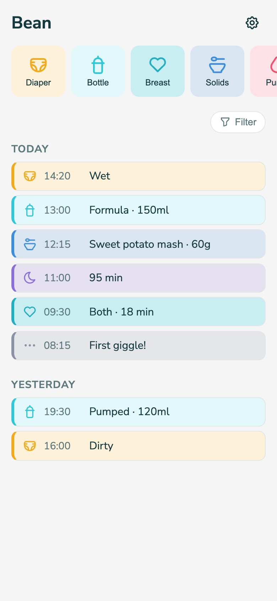
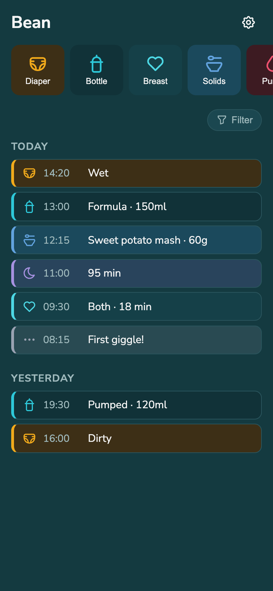

# Bean

A baby tracker for two people, built to stay out of your way.

<p align="center">
  
  
</p>

## What is this?

Bean logs the things new parents end up tracking constantly — diapers, feeds, sleep,
meds, whatever — without turning into another app full of ads, streaks, and screens
you don't need. It's just a row of icon buttons to log something, and a list of what's
already been logged. That's the whole app.

Two people can use it at once — no accounts, no login, just a shared link. Whichever
categories you don't need (maybe you don't pump, maybe there are no meds to track),
you turn off in Settings and they disappear everywhere, including from the log
filters. It installs like a normal app on your phone's home screen.

**It's deliberately the least cluttered version of this idea we could make.** No
graphs, no streaks, no social features, no onboarding flow you have to click through
twice. Log something, see what's been logged, done.

## Installing it

This is meant to be self-hosted — there's no public instance to sign up for. If
you're comfortable with Docker, this is a few minutes of work.

### Quickest: Coolify (or any Docker Compose host)

1. Push this repo to a git remote your host can reach.
2. Create a new "Docker Compose" resource pointing at this repo's `docker-compose.yml`.
3. Give the `frontend` service a public domain. That's the only piece that needs one —
   it serves the app and forwards API calls to the `backend` service internally.
4. Done. The `bean-data` volume keeps your data across redeploys.

### Or plain Docker, on any machine

```bash
docker compose up --build
```

Serves the whole thing on `http://localhost:3000` (change the port in
`docker-compose.yml` if that's taken).

### Running it for development

Two servers, in separate terminals:

```bash
cd backend && npm install && npm run dev
```

```bash
cd frontend && npm install && npm run dev
```

The frontend runs on `http://localhost:5173` and proxies API calls to the backend on
`:3001`.

**A note on privacy:** there's no login. Anyone with the URL can read and write your
data. That's fine behind a private domain for family use — it is not something you
should put on the open internet.

Curious how it's built? See [docs/TECHNICAL.md](docs/TECHNICAL.md) for the stack and
architecture.

---

*This app was entirely vibe coded — built by describing what it should do and letting
an AI write the code, rather than being hand-written line by line. It's had real
testing and use, but keep that in mind if you go poking around the source.*
