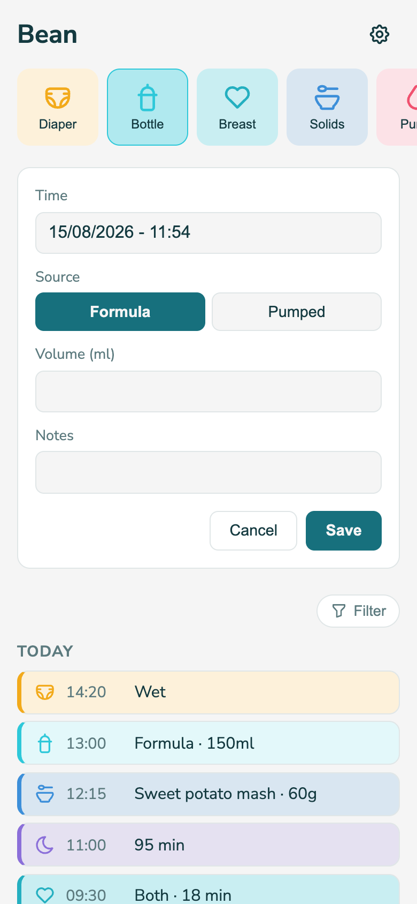

# Bean

A baby tracker for two people, built to stay out of your way.

<p align="center">
  
  
</p>

## What is this?

Bean logs the things new parents care about tracking — diapers, feeds, sleep,
meds, whatever — without turning into another app full of ads, graphs, streaks, and screens
you don't need. You're not running post-graduate data-analysis on your baby. It's just "log something", "see what's been logged". That's it. That's the whole app.

Multiple people can use it at once — no accounts, no login, just a shared link. Whichever
categories you don't need (maybe you don't pump, maybe there are no meds to track),
you turn off in Settings and they disappear everywhere, including from the log
filters. You can add it as an app to your home screen for easy access. 

> [!WARNING]
>**A note on privacy:** since there's no login. Anyone with the URL can read and write your
> data. If you host this somewhere private that's fine, but know that when it's publicly available, everyone can read/write. So: Doxx your baby at your own risk (no personal info — except for,  you know, when they pooped — is shown). 

This app was entirely vibe-coded while taking care of a 3-day old baby, so I can personally guarantee that it is "baby-brain-fog" proof.

## Installing

This is meant to be self-hosted. If you're comfortable with Docker, this is a few minutes of work.

### Quickest: Coolify (or any Docker Compose host)

1. Push this repo to a git remote your host can reach.
2. Create a new "Docker Compose" resource pointing at this repo's `docker-compose.yml`.
3. Give the `frontend` service a public domain. That's the only piece that needs one —
   it serves the app and forwards API calls to the `backend` service internally.
4. Done. The `bean-data` volume keeps your data across redeploys.

### Or plain Docker, on any machine

```bash
docker compose up --build
```

Serves the whole thing on `http://localhost:3000` (change the port in
`docker-compose.yml` if that's taken).

### Running it for development

Two servers, in separate terminals:

```bash
cd backend && npm install && npm run dev
```

```bash
cd frontend && npm install && npm run dev
```

The frontend runs on `http://localhost:5173` and proxies API calls to the backend on
`:3001`.

Curious how it's built? See [docs/TECHNICAL.md](docs/TECHNICAL.md) for the stack and
architecture.
